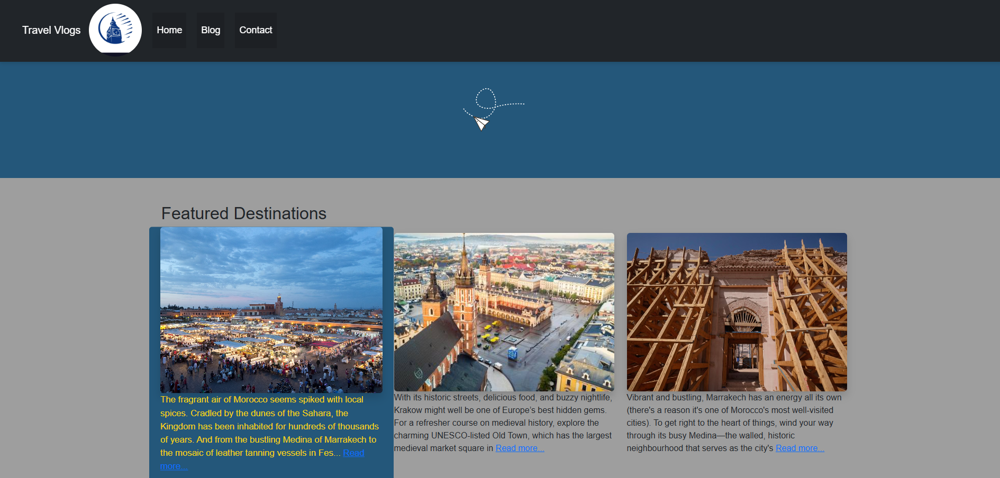
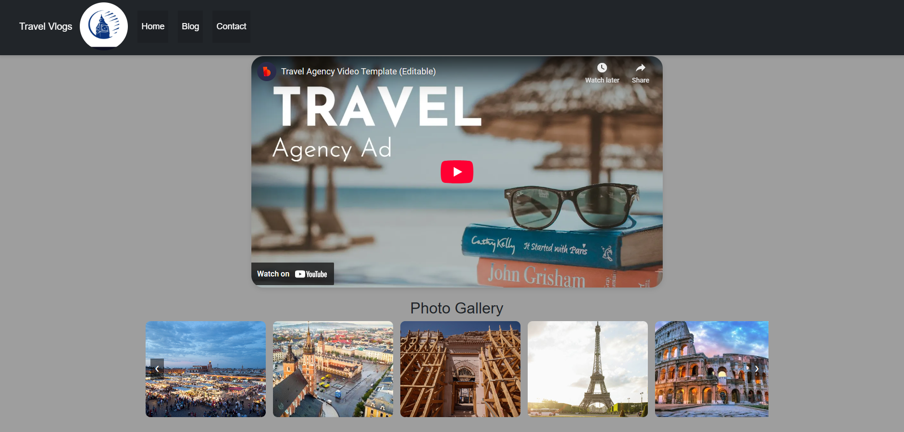

# Travel Blog - Explore the World 🌍

## Description
A responsive and interactive travel blog showcasing travel experiences through captivating visuals, immersive stories, and interactive features. This site includes an embedded video section, interactive photo gallery, Google Maps integration, and a spinning prize wheel for user engagement. Built with HTML, CSS, Bootstrap, JavaScript, and jQuery.

## The Values:
- **Inspiration**: Encourages people to explore the world by sharing unique travel stories and experiences.
- **Accessibility**: A responsive design ensures a seamless user experience across all devices.
- **Engagement**: Features like the prize wheel, gallery, videos, and Google Maps enhance interaction.
- **Creativity**: Combines stunning visuals, animations, and layout for a pleasant browsing experience.
- **Community**: Offers a platform for travelers to connect, inspire, and share moments.

## Features
- **Responsive Design**: Optimized for desktops, tablets, and smartphones.
- **Navigation Bar**: Clean and collapsible navigation, works seamlessly across screen sizes.
- **Embedded Video Section**: Showcases immersive travel content via YouTube.
- **Interactive Photo Gallery**: Hover effects and scroll buttons for easy navigation.
- **Spinning Prize Wheel**: Gives users a chance to win discounts, vouchers, or free travel packages.
- **Google Maps Integration**: Displays location-based travel destinations.
- **Smooth Hover Effects**: For buttons, icons, and images using CSS transitions.
- **Contact Page**: Includes prize wheel and an embedded map for location info.

## External Resources
This project took design photos and  inspiration and reference content from:
- [TripAdvisor UK]
- Google images.
- Wikipedia (each city descriptions)

## Screenshots

### Homepage  


### Blog Page  


### Contact Page with Prize Feature  


## Testing:
### W3C:


### Jslint:


### Lighthouse :


### Jest :


### Manual testing:
.jpg)

## Wireframe Structure


## Technologies Used
- HTML5  
- CSS3  
- Bootstrap 5  
- JavaScript (ES6)  
- jQuery 3.7.1  
- Google Maps JavaScript API  
- Jest (for testing)

## Installation

Clone the repository:

```bash
git clone https://github.com/your-username/travel-blog.git


## Usage
Navigate: Explore the blog using the responsive navigation bar.

Watch Videos: Embedded YouTube videos provide an immersive experience.

View Photos: Browse the interactive photo gallery with smooth animations.

## Contributing
Contributions are welcome! Feel free to open an issue or submit a pull request for improvements.

## License
This project is licensed under the MIT License. See the LICENSE file for details.
