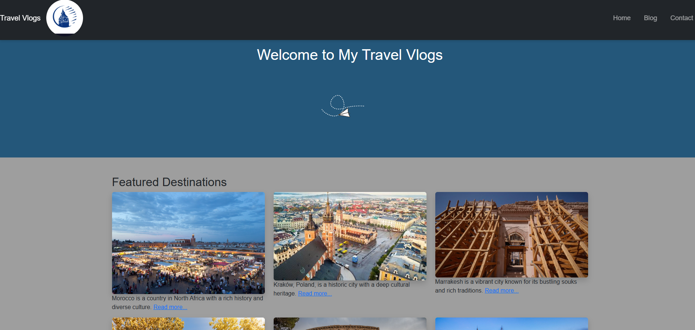
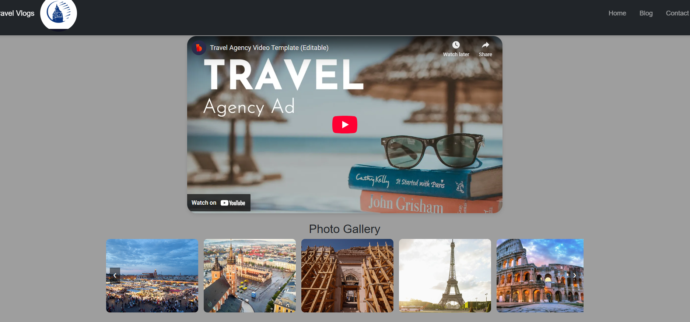

#Travel Blog - Explore the World 🌍

## Description
A responsive and interactive travel blog showcasing travel experiences through captivating visuals and stories. Features include a clean navigation bar, a responsive video section, and an interactive photo gallery with navigation controls. Built with HTML, CSS, Bootstrap, and jQuery.
## The values :
Inspiration: Encourages people to explore the world by sharing unique experiences and stories.

Accessibility: A responsive design ensures a seamless user experience across devices.

Engagement: Features like the interactive photo gallery and video section captivate visitors.

Creativity: Combines beautiful visuals and a clean layout for an enjoyable browsing experience.

Community: Provides a platform for travelers to connect, share, and inspire others.

## Features
Responsive Design: Ensures seamless experience across devices.

Navigation Bar: Fully functional with support for smaller screens.

Embedded Video Section: Share immersive travel content.

Interactive Photo Gallery: Features navigation buttons and hover effects.

Modern Aesthetics: Clean layout with rounded corners and subtle shadows.
Prize :Spine wheel for users to get a change for discount or voucher or free travels packages 

# Screenshots

Here are some screenshots of the Travel Vlogs project:

### Homepage

### Blog Page

### Contact Page with Prize Feature

## Technologies Used
HTML5

CSS3

Bootstrap 5

jQuery 3.7.1
Javascript 
Jest testing

## Installation
Clone the repository:

bash
git clone https://github.com/your-username/travel-blog.git
Open index.html in your browser to view the site.

## Wireframe Structure

## Usage
Navigate: Explore the blog using the responsive navigation bar.

Watch Videos: Embedded YouTube videos provide an immersive experience.

View Photos: Browse the interactive photo gallery with smooth animations.

## Contributing
Contributions are welcome! Feel free to open an issue or submit a pull request for improvements.

## License
This project is licensed under the MIT License. See the LICENSE file for details.
